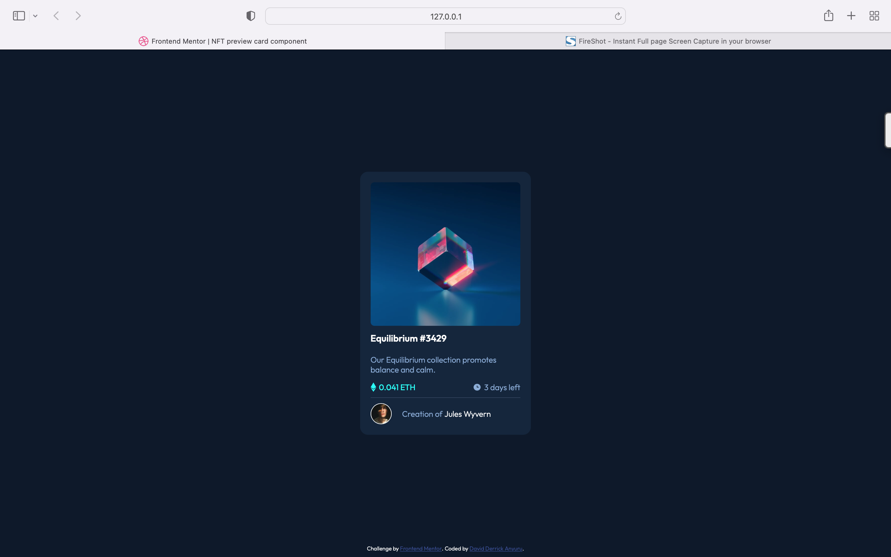

# Frontend Mentor - NFT preview card component solution

This is a solution to the [NFT preview card component challenge on Frontend Mentor](https://www.frontendmentor.io/challenges/nft-preview-card-component-SbdUL_w0U). Frontend Mentor challenges help you improve your coding skills by building realistic projects. 

## Table of contents

- [Overview](#overview)
  - [The challenge](#the-challenge)
  - [Screenshot](#screenshot)
  - [Links](#links)
- [My process](#my-process)
  - [Built with](#built-with)
  - [What I learned](#what-i-learned)
  - [Continued development](#continued-development)
  - [Useful resources](#useful-resources)
- [Author](#author)
- [Acknowledgments](#acknowledgments)

**Note: Delete this note and update the table of contents based on what sections you keep.**

## Overview

### The challenge

Users should be able to:

- View the optimal layout depending on their device's screen size
- See hover states for interactive elements

### Screenshot

### Links

- Solution URL: [Check it out here ](https://github.com/ANYURU/frontendmentorchallenges/tree/main/nft-preview-card-component-main)
- Live Site URL: [Check it out here ](https://quiet-maamoul-ea44ea.netlify.app)

## My process
- Build Structure.
- Add the fonts. 
- Style the components.
- Host it. 
- Document the process.

### Built with

- Semantic HTML5 markup
- CSS custom properties

### What I learned
My biggest take was how to make an overlay where a learnt about the CSS positioning property what each value entials.

### Continued development
I will experiment more with the positioning in CSS and learn which positioning works best in which scenarios.

## Author

- Website - [David Derrick Anyuru](https://https://anyuru.github.io)
- Frontend Mentor - [@yourusername](https://www.frontendmentor.io/profile/)
- Twitter - [@anyurudavid](https://twitter.com/anyurudavid)

## Acknowledgments

To my career mentors friends and family, let's keep it going.