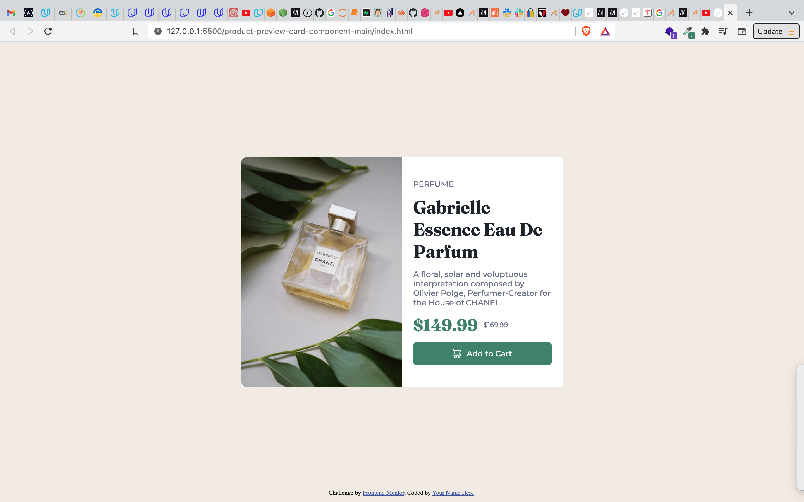
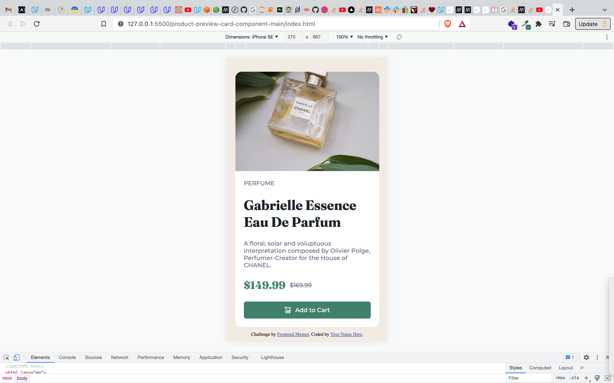

# Frontend Mentor - Product preview card component solution

This is a solution to the [Product preview card component challenge on Frontend Mentor](https://www.frontendmentor.io/challenges/product-preview-card-component-GO7UmttRfa). Frontend Mentor challenges help you improve your coding skills by building realistic projects. 

## Table of contents

- [Overview](#overview)
  - [The challenge](#the-challenge)
  - [Screenshot](#screenshots)
  - [Links](#links)
- [My process](#my-process)
  - [Built with](#built-with)
  - [What I learned](#what-i-learned)
  - [Continued development](#continued-development)
  - [Useful resources](#useful-resources)
- [Author](#author)
- [Acknowledgments](#acknowledgments)

**Note: Delete this note and update the table of contents based on what sections you keep.**

## Overview

### The challenge

Users should be able to:

- View the optimal layout depending on their device's screen size
- See hover and focus states for interactive elements

### Screenshots




### Links

- Solution URL: [here](https://your-solution-url.com)
- Live Site URL: [here](https://elaborate-frangipane-bb2289.netlify.app/)

## My process

### Built with

- Mobile-first workflow
- Semantic HTML5 markup
- CSS media queries
- Flexbox

### What I learned

1. Adding an image to an HTML element using the CSS properties. 
  For example: 
```CSS
.product {
  background-image: url('../images/image-product-desktop.jpg');
  background-size: cover;
}
```

2. Transforming the contents of an HTML element using the `text-tranform` CSS property. This property helped me change the casing of the text.
For example:
```CSS
h1 {
  text-transform: capitalize;
}
```


### Continued development

Exploring the flexbox and the CSS text properties. I would also like to use more semantic tags. 


### Useful resources

Learn how to add background images [here](https://www.youtube.com/watch?v=zHZRFwWQt2w)

**Note: Delete this note and replace the list above with resources that helped you during the challenge. These could come in handy for anyone viewing your solution or for yourself when you look back on this project in the future.**

## Author

- Website - [David Derrick Anyuru](https://anyuru.github.io/)
- Frontend Mentor - [@ANYURU](https://www.frontendmentor.io/profile/ANYURU)
- Twitter - [@anyurudavid](https://twitter.com/anyurudavid)


## Acknowledgments
To all my friends and family, doing this for fun. Here goes nothing.

